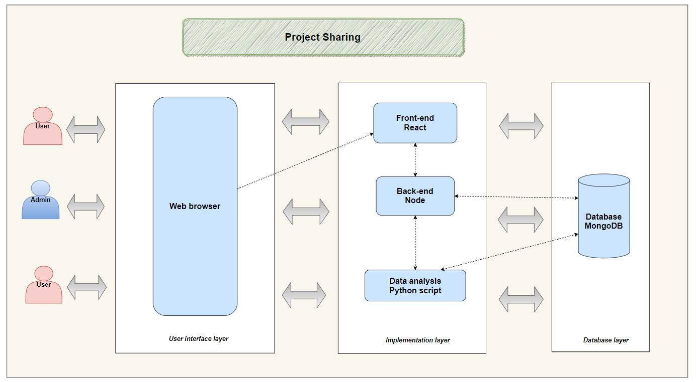

# Sharing

Project for 2023 ConUHacks VII 

[DevPost link](https://devpost.com/software/gosoft-challenge-project-sharing)

## Inspiration
Our project is designed to help companies understand how satisfied interns are with the company and how they achieve interaction with their interns. When we considered how to demonstrate employee satisfaction, we first considered the need to protect employees' privacy and allow them to speak freely. Therefore, we chose the anonymous forum and took some features from the anonymous forums that we had joined. And when thinking about how to help managers understand intern satisfaction, we associated it with data analysis, which in turn required quantification of satisfaction.

## What it does
On the poster side, to ensure that all posters in the forum are internal interns, posters are required to verify their identity by first entering the unified verification code given to interns by the company. To quantify how satisfied interns are with the company, we introduced a rating system and allowed users to like posts made by other users. On the admin side, we asked managers to log in with their account password to access the admin backend, where they could manage posts in the forum and view reports generated online from analysis of intern satisfaction data. The reports provide the ability to extract keywords, which will help managers better understand how the company environment is perceived by interns.

## How we built it
We used React to implement the front-end user page and administrator page and used Node.js to access MongoDB to manage the forum data on the back end. For data analysis, we wrote a Python script to organize and calculate the data and used natural language processing APIs to extract the adjectives that were mentioned top 5 most often in posts. Whenever the button to generate a report is clicked, the Node.js script calls the Python script to generate a real-time data report and store it in the database, which is then finally rendered on the front-end web page.

## Setup Instruction

#### Install Docker

#### Run mongodb using docker container
```
docker pull mongo:latest


docker run -d -p 27017:27017 --name test-mongo mongo:latest
```

####  Run Backend Server
```
cd backend
npm install
node index.js
```

#### Run Frontend Server
```
cd frontend
npm install --legacy-peer-deps
npm start
```
## System Diagram



## Built With 
- MongoDB
- NLTK
- Node.js
- Python
- React